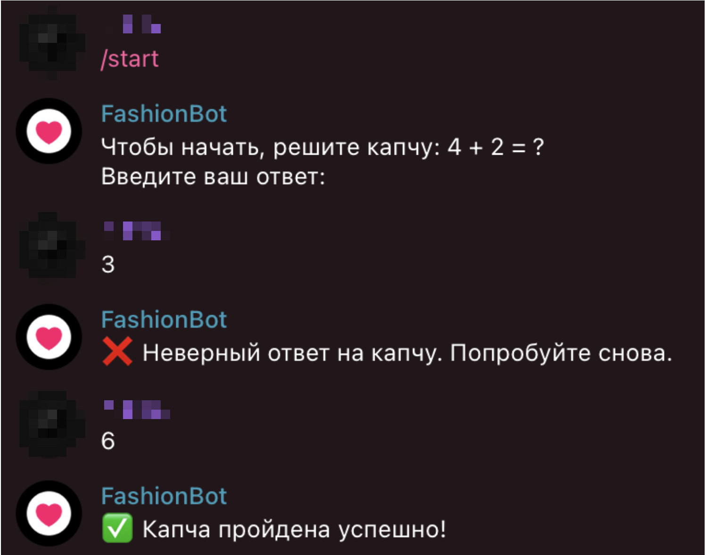
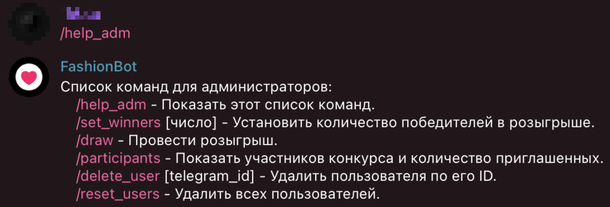
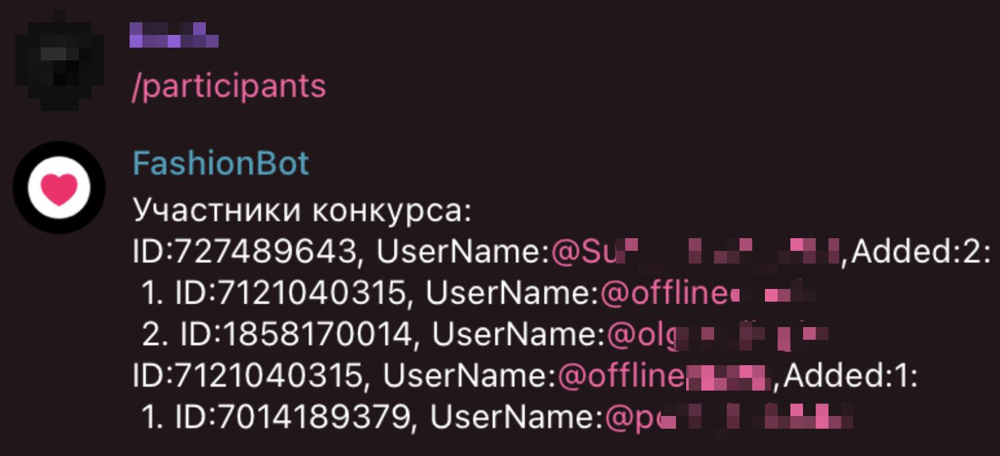

# 📊 Telegram Referral Bot

Этот проект представляет собой Telegram-бота с встроенной реферальной системой, регистрацией пользователей через капчу, проверкой подписки на каналы и функциональностью проведения розыгрышей. Разработан как учебный проект для практики разработки на Python и интеграции с Telegram Bot API.

## Цели проекта

- Реализация Telegram-бота с использованием `aiogram`
- Построение реферальной системы с уникальными ссылками
- Проверка пользователей через капчу и обязательную подписку
- Хранение данных пользователей и реферальных связей в базе SQLite
- Предоставление административных команд для управления ботом и проведения розыгрышей

## Функциональность

### Для пользователей

- **Регистрация через команду /start** с капчей и возможностью указать реферальный код
- **Проверка подписки** на обязательные каналы
- **Генерация персональной реферальной ссылки** после регистрации
- **Начисление баллов** ("билетов") за каждого приглашённого пользователя
- **Интерактивные кнопки** для удобного взаимодействия (например, кнопка "Участвовать")

### Для администраторов

- `/set_winners [число]` — установить количество победителей розыгрыша
- `/draw` — провести розыгрыш (шанс зависит от количества билетов)
- `/delete_user [telegram_id]` — удалить пользователя по ID
- `/reset_users` — сбросить всех пользователей
- `/participants` — показать список участников и их реферальные данные
- `/help_adm` — справка по админ-командам

### Защита и проверка

- Капча: простой арифметический пример для защиты от ботов
- Проверка подписки на обязательные каналы
- Доступ к админ-командам только для пользователей из списка `ADMIN_USERNAMES`

### База данных

Используется база данных **SQLite (database.db)** для хранения:

- Telegram ID пользователя
- Уникального реферального кода
- ID пригласившего пользователя (если есть)
- Количества приглашённых
- Статуса участия в розыгрыше

## Используемые технологии

- **Python 3.10+**
- **aiogram** — асинхронная библиотека для Telegram-ботов
- **SQLite** — лёгкая встроенная база данных
- **asyncio** — для асинхронной обработки логики
- **random** — для выбора победителей
- **PyCharm / SQLiteStudio** — инструменты разработки

## Тестирование и результаты

Проект протестирован на реальных пользователях Telegram. Проверено:

- Корректная работа капчи
- Проверка подписки на каналы
- Учёт баллов и начисление бонусов
- Логика выбора победителей
- Все админ-команды работают стабильно

## Скриншоты примерного сценария работы

## Автор

Разработано как учебный проект по информационной безопасности.  
[GitHub профайл](https://github.com/CozlovschiNichita)
